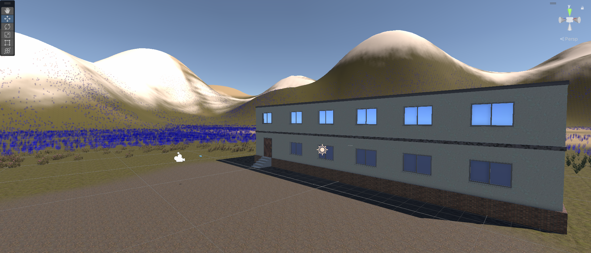
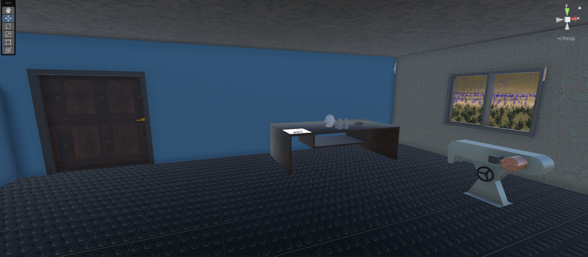
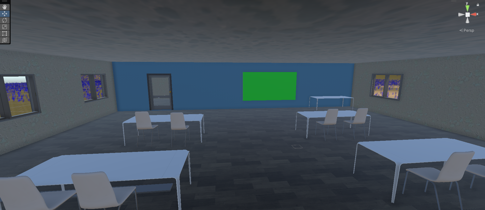

# VR Safety Training: Grinding Machine

This project is a Virtual Reality (VR) safety training program focused on operating a Belt grinding machine. The training program is designed to provide users with an immersive and interactive experience, helping them understand the safe operation of a grinding machine.

## Features

- **Functional 3D Model of a Grinding Machine**
  - **Interactive User Interface**: Users can interact with various parts of the machine, including:
    - Grinding machine using button
    - Safety equipments (gloves, Earplugs, Safety Shoes etc)
    - Playing the Instruction Video
  - **Movable Elements**:
    - Door animations
    - Machine Grinding Belt
  - **Material Interaction**:
    - Hovering Changes the color showing which object is being interacted with.

## Getting Started

### Software Requirements

- **Unity**: 2022.3.34f1

### Installation

1. **Download the VR_simulator.rar** from [here](https://github.com/jaypatel2103/VR-belt-grinder-safety-training).
2. **Extract the files** to a directory of your choice.
3. **Open the project** in Unity:
   - Launch Unity Hub.
   - Click on `Open` and navigate to the extracted project directory.
   - Select the project and click `Open`.
4. **Run the Training Program**:
   - In Unity, go to the `Scenes` folder.
   - Open the `Introduction` scene.
   - Press `Play` to start the VR safety training.

## Images

